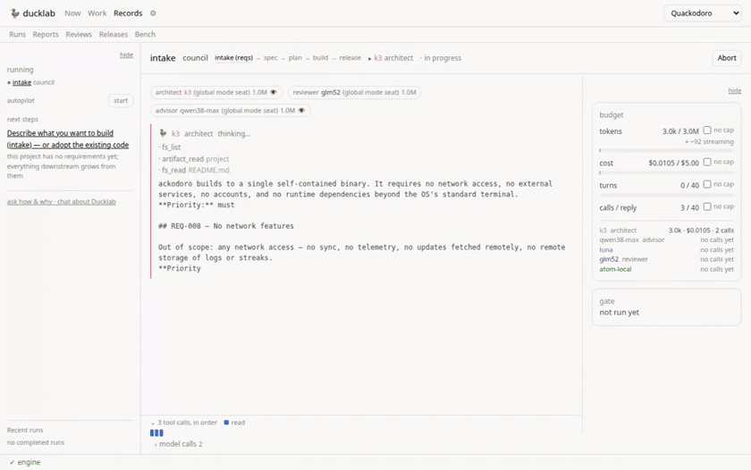
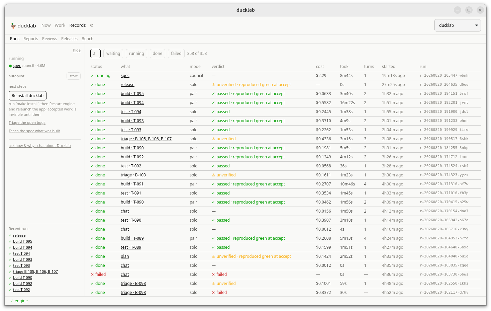
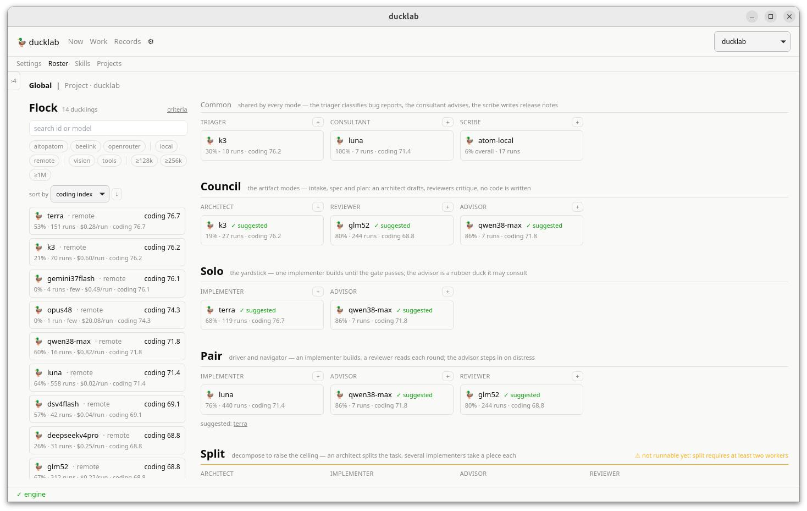
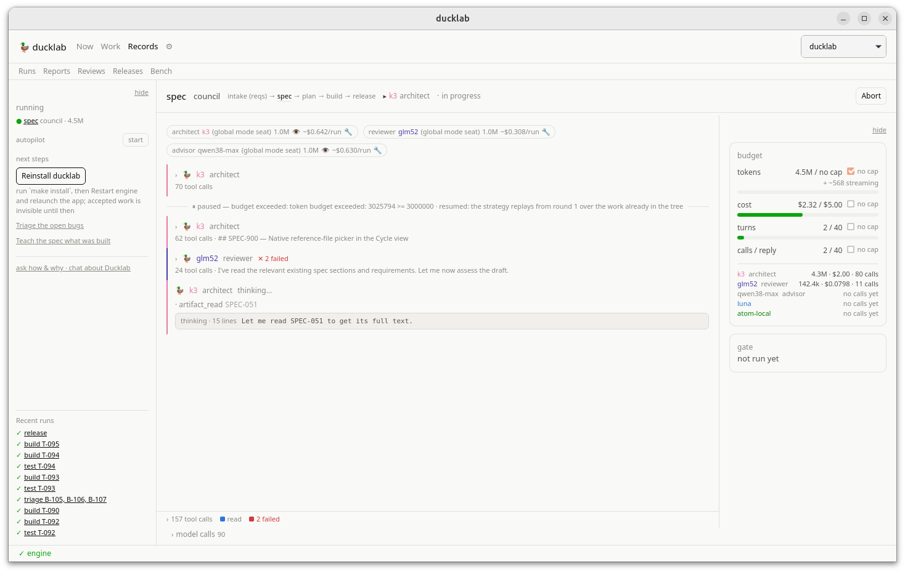
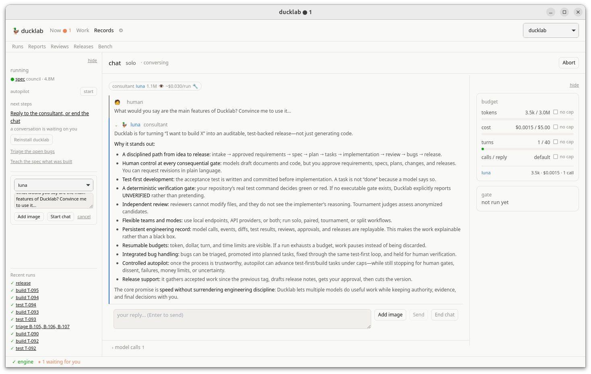

# Ducklab

A full-cycle software development harness that is **multi-LLM by default**
and honest by construction.

You give it a brief. It writes requirements, a spec and a plan; builds tasks
with one model or several arguing; runs your project's real test gate; and
stops for you before anything is committed. Every model call is logged. No
model ever decides a verdict.

<p align="center">
  
  <br><em>A real council intake, recorded live and sped up: the architect streams the draft, a different model reviews it, the budget ticks in cents — and the run stops at <strong>your</strong> gate. Total cost of what you just watched: $0.07.</em>
</p>

It was built for **local models first** — the two that built most of it are a
vLLM box on the LAN and a llama.cpp server on localhost, both priced at zero —
and hosted models sit beside them in the same roster, measured by the same
evidence.

## Why this exists

Most agentic coding tools assume one strong model and trust it. Ducklab
assumes **several cheap models and trusts none of them**:

- **The gate decides, never a model.** A verdict is a command's exit code.
  A test-first run measures a green **baseline** before any test is written,
  the red **over the new test** after, and every accept **reproduces the gate
  from a clean checkout of the committed sha** — nothing lands that did not
  reproduce, and an accept whose reproduction fails takes its own commit back.
- **Decorrelation everywhere.** A different model reviews; a reviewer never
  learns who wrote the code (absent from the payload, not hidden in the UI);
  tournament judges choose blind; council critics read the draft, not each
  other.
- **Work is a contract.** A task's deliverables are the implementer's
  numbered checklist; it reports on each by number, the reviewer checks each
  against the diff, and an undelivered item summons the **rubber duck** — an
  advisor seat that wakes only on measured distress (brake refusals, failure
  streaks, red gates) and answers `none`, a note that sends the implementer
  straight back to work, or `stop`.
- **Seats are chosen on evidence.** Every duckling carries a scorecard —
  in-seat pass rate from your own runs, cost per run, coding index — and the
  roster board suggests seats from it, with the ranking criteria yours to
  reorder. Suggestions are rare and justified: pass rates rank by their
  Wilson lower bound, three runs minimum, locals never win on a $0 price.
- **Nothing is unbounded.** Turns, tokens, cost, wallclock, tool output,
  shell commands — every ceiling visible and liftable mid-run, on the record.
- **Your documentation is not bounded by the model's window.** Attach a wiki
  to a stage and a big seat reads it whole; a small seat gets each document
  digested to fit, the full text one `ref_read` call away, and the gate
  names any document nobody opened. A 32k local model can be briefed by a
  quarter-million characters of reference material — the harness carries the
  working memory.

<p align="center">
  
  <br><em>The record does not round up: every run with its verdict, its cost, and whether its accept <strong>reproduced green from a clean checkout</strong>.</em>
</p>

And the existence proof: **ducklab is developed inside ducklab.** The plan,
the bugs, the releases and the last ninety-plus accepted tasks went through
its own loop, driven by the same local and hosted models it measures — most
recent features (the multimodal chat, the consultant seat, the guide rail's
run history) were built by the duck, gated by a person.

## Status

**v0.6.1+**, moving fast. Seven stages, five modes, the roster board with
evidence and suggestions, reference documents with automatic digestion,
skills managed from the desktop, a seated consultant you can chat with
(images included, vision verified before they are sent), bugs with
screenshot evidence, releases, autopilot, a CLI, a desktop app, and an
**MCP server** that lets another model operate the whole loop with
recorded, attributed decisions.

[`docs/status.md`](docs/status.md) tracks all acceptance criteria and does
not round up. Where code and spec differ, the difference is recorded in
[`docs/decisions/`](docs/decisions/).

## Install

Needs Go 1.24+, Node 22+ for the desktop, and git.

### Linux

The CLI and engine are pure Go. The desktop is a Wails v3 app and needs the
GTK/WebKit development packages:

```bash
sudo apt install libgtk-3-dev libwebkit2gtk-4.1-dev   # Debian/Ubuntu names
make desktop && make install
```

On Ubuntu 24.04+ the desktop also needs an AppArmor profile — see
[decision 0003](docs/decisions/0003-apparmor-userns.md) and
`packaging/apparmor/`.

### macOS

```bash
xcode-select --install    # the desktop build links against WebKit
brew install go node
make desktop && make install
```

Honesty note: ducklab is developed and exercised daily on Linux. The CLI and
engine compile-check for `darwin/arm64` on every `make cross`, but no desktop
build has been verified on a Mac yet — the first person to try it is the
test, and `make install` gives you the CLI and engine either way. Please
report whatever breaks.

### Both

`make install` installs to `~/.local/bin` — make sure it is on your `PATH`.
It warns when the desktop binary predates `frontend/src`, because it will
happily install a stale one.

## Three binaries

| | What it is |
|---|---|
| `ducklab-engine` | The daemon. Owns every run. Binds 127.0.0.1 only, bearer token rotated each start. |
| `ducklab` | The CLI client. Holds no state; it asks the engine. |
| `ducklab-desktop` | The desktop app. Also a client, also holds no state. Starts (or adopts) the engine itself. |

Provider keys come from the engine's environment at call time — export them
before it starts, or launch the desktop through a wrapper that loads them
from your keyring. The app tells you when the engine it adopted is missing a
key this app has, with the restart button beside the words.

## A cycle, end to end

From the desktop: **Projects → New project**, then **Cycle → Draft it**. From
a terminal:

```bash
cd ~/dev/myproject
git init                                    # ducklab needs a git repo
ducklab project init --name MyProject

ducklab intake --from brief.txt             # brief        → requirements
ducklab spec                                # requirements → spec
ducklab plan                                # spec         → milestones and tasks

ducklab run T-001                           # build it
ducklab run accept r-20260729-...           # commit it

ducklab review T-001                        # read the commit
ducklab release plan --bump minor           # what shipped
```

Each stage writes a `.proposed` file first and waits for you. `accept`
promotes it; `reject` restores exactly what the run wrote and nothing else;
"request changes" sends any draft — spec, plan, release notes — back with
your note. Nothing is committed without you (or without the autonomy level
you explicitly granted).

**Reference documents** ride any stage: `--ref ~/wiki/product/` (or the
attach door in the desktop) loads files or whole directories as background
for the architect — grounded by two rules the prompt states outright: the
approved requirements own the scope, and where a reference and the code
disagree, the code is the truth. When the corpus outgrows the seat's
context, each document is digested once (cached by content hash), the full
text stays reachable through the `ref_read` tool, and the proposal card
lists any document no seat ever opened.

**Adopting an existing codebase** works the same way: intake reads the code
and writes as-built requirements, the spec marks its sections `as-built`, and
the plan stays deliberately empty — new work then enters through bug reports
and plan amendments, which is how ducklab itself is developed.

Your project declares its own truth in `.ducklab/project.toml`: the gate
(`[verify]` — with `link_deps` and `setup` for what a clean checkout needs),
how the app launches (`[run]` with a preflight), and how the project's own
binaries are rebuilt (`[install]`) so the whole loop runs without leaving
ducklab.

## Adding a model

```bash
ducklab provider set openrouter --url https://openrouter.ai/api/v1 \
                                --key-env OPENROUTER_API_KEY
ducklab duckling set pato-sonnet --provider openrouter \
                                 --model anthropic/claude-sonnet-4.5 \
                                 --roles reviewer,judge --context 200000 \
                                 --cost-in 3.0 --cost-out 15.0
ducklab duckling test pato-sonnet --prompt "say OK"
```

`--key-env` is the **name** of an environment variable, never a key. No key
is written to config, sent over the API, or kept in shell history.

<p align="center">
  
  <br><em>Seats are argued with evidence: pass rates from your own runs, cost per run, coding index — suggestions justified, never imposed.</em>
</p>

The desktop's **Roster** view is where seats are assigned: drag from the
Flock onto a mode's seat, globally or per project, with each duckling's
evidence on the card and the engine's suggestions beside the seats. Coding /
intelligence / agentic indices come from OpenRouter's benchmarks endpoint
when a duckling lives there; your own runs supply the rest.

<p align="center">
  
  <br><em>The same machinery on real work: a council revising ducklab's own spec, 4.5M tokens in, paused once on a budget it asked to lift.</em>
</p>

## The five modes

`ducklab run T-001 --mode <mode>`

| Mode | What it does |
|---|---|
| `solo` | One duckling. The yardstick everything else is measured against. |
| `pair` | Implementer and reviewer, decorrelated. Between them the advisor — the rubber duck. |
| `tournament` | Contestants build the same task in isolated worktrees; a judge picks, blind. |
| `split` | An architect decomposes; subtasks run in parallel; integration is file copies, no model involved. |
| `council` | Several models on one document, for intake, spec, plan and review. One drafts, the others critique blind, the first revises. |

## What it will not do

These are load-bearing, not preferences.

- **A model never decides a verdict.** A gate is a command's exit code.
- **A green candidate is applied byte-for-byte.** Nothing is re-generated
  after it passed.
- **A reviewer never learns who wrote the code.**
- **Nothing lands that did not reproduce** from a clean checkout.
- **A reject undoes what the run wrote, and nobody else's work.**
- **Nothing is unbounded.**
- **Secrets never touch project state.**
- **The engine is loopback-only.** There is no remote mode.

## Skills

A skill is a directory with a `SKILL.md` — under `.ducklab/skills/` for one
project, or in the machine-wide skills directory to serve every project
(project shadows global on a name collision). The documentation-only form
has no script and is the default: a recipe a model reads and follows. The
architect reads survey guides before an adopt (`skill_list` is in its
prompt), the consultant reads them in chat, and only the implementer can
`skill_run` an executable one.

Skills are administered from the desktop (**gear → Skills**): list with
scope badges and validation problems, read, edit the whole `SKILL.md`,
run with arguments, delete. A skill a duckling writes during a run shows
there greyed `pending acceptance` until its run is accepted — proposing a
skill goes through the same gate as proposing code.

```bash
ducklab skill new house-style
ducklab skill run changelog-entry --arg summary="..."
```

## The consultant

Every project seats a **consultant** (a Common seat on the roster board):
the model behind the "chat about this" doors and the free-form chat in the
guide rail. It reads the code, the runs, the boards and the skills — never
writes — and takes **images**: paste a screenshot of a broken view and ask.
Vision is verified, not assumed: a declared-vision seat is probed with a
real image request once, and a text-only seat refuses the paste with words
instead of hallucinating an answer.

<p align="center">
  
  <br><em>Asked to sell the product, the seated consultant read the repo and wrote this pitch itself. We kept it.</em>
</p>

## Operating ducklab from another model

`ducklab mcp serve` exposes the whole loop over stdio as an MCP server: an
external model reads each result, decides gates (with a required, recorded
reason — decisions land as `approved_by: mcp:<client>`, never as "human"),
answers questions, files bugs, amends plans and starts work. The engine's
`next` lists are the law: an operator cannot take an action a person could
not.

## Contributing

See [CONTRIBUTING.md](CONTRIBUTING.md) — how to build, how the tests guard
the architecture, how work flows through ducklab's own loop, and where to
start. The short version:

```bash
make            # vet, test, build the frontend
go test ./...   # 38 packages
cd frontend && npx vitest run
```

**License:** [Apache-2.0](LICENSE). Contributions are accepted under the
same terms (§5 of the license — no CLA). The Ducklab name and the duck are
the maintainer's (§6).

## Specification

The code implements a written specification, in this repo:
[`docs/spec/`](docs/spec/) (00-VISION through 08-DESKTOP-UI) is the
**normative** layer — vision, invariants, protocol contracts, acceptance
criteria. What the system IS today lives in `.ducklab/docs/` — the as-built
requirements, spec and plan the loop itself maintains, each version signed
at a human gate. Where the two differ deliberately, the difference is
recorded in [`docs/decisions/`](docs/decisions/); the diff between them is
the roadmap, and the alignment stage computes it.
